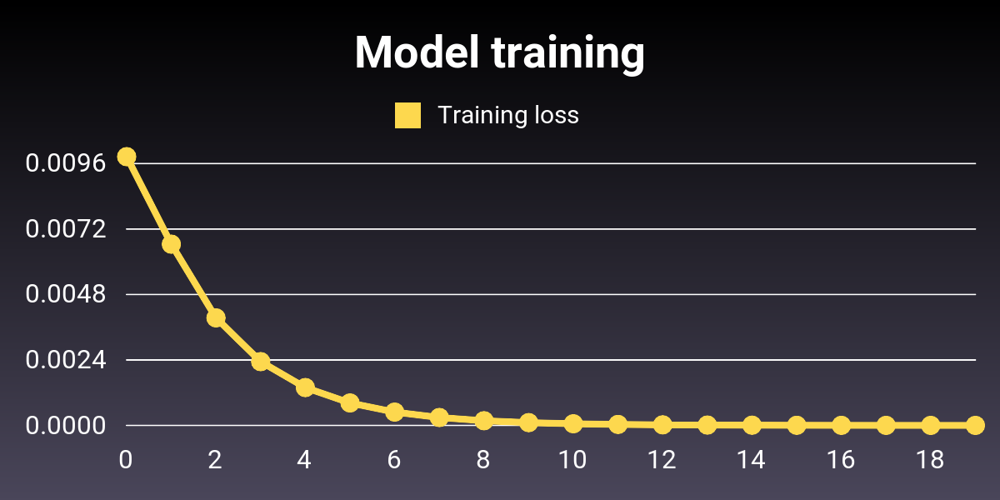

# Neurony McNeuronface : Deep learning for fun

Not-for-production & slow deep learning with Ruby.


## Installation

Install the gem and add to the application's Gemfile by executing:

  $ bundle add neurony-mc-neuronface

If bundler is not being used to manage dependencies, install the gem by executing:

  $ gem install neurony-mc-neuronface

## Usage

### Training a basic model

The first step is to create a dataset to handle our _training examples_. Here, we use the `Memory`
implementation which wraps an array of examples.

Each of the training examples is composed of a _vector_ (i.e. an array) of inputs and a vector of outputs.
Here, each example consists in a value of temperature in Celsius degrees as the input, and a value in
Fahrenheit degrees as the output:

```ruby
require "neuronface"

data = [
  [[-40.0], [-40.0]],
  [[-10.0], [14.0]],
  [[0.0], [32.0]],
  [[8.0], [46.4]],
  [[15.0], [59.0]],
  [[22.0], [71.6]],
  [[38.0], [100.4]]
]
```

We normalize the inputs and outputs so that their values are shifted to the 0-1 range. We also
tell Neuronface to shuffle values at each training _epoch_ so that there's no influence of the order of the examples on the training process:

```ruby
dataset = Neuronface::Datasets.get(:memory)
                              .new(data)
                              .normalize!
                              .shuffle!
```

Now we create a single-layer, single-neuron perceptron _model_, and train it on all examples during 20
_epochs_. We use the _mean squared error_ (MSE) _loss function_ and _rectified linear unit_ (ReLU) as the
activation function:

```ruby
model = Neuronface::Model.new(loss: :squared_error)
                         .append(:input, 1)
                         .append(:dense, 1, activation: :relu)
history = model.fit(dataset, :simple, epochs: 20)
```

Now that our model is trained we can make a prediction on novel/unknown input:

```ruby
puts dataset.outputs_normalizer.revert(model.predict(dataset.inputs_normalizer.convert([100])))
# => 211.7616137915528
```

We'd like to plot the training loss across the epochs to see how your model is fitting to the
training data, for example using [Gruff](https://github.com/topfunky/gruff):

```ruby
def plot_labels(history)
  label_count = [10, history[:loss].size].min
  label_count.times
             .map { |i| i * history[:loss].size / label_count }
             .each_with_object({}) { |value, hash| hash[value] = value.to_s }
end

def plot(history)
  g = Gruff::Line.new("1200x600")
  g.labels = plot_labels(history)
  g.title = "Model training"
  g.data "Training loss", history[:loss]
  g.write "training.png"
end

plot(history)
```



## Development

After checking out the repo, run `bin/setup` to install dependencies. Then, run `rake test` to run the tests. You can also run `bin/console` for an interactive prompt that will allow you to experiment.

To install this gem onto your local machine, run `bundle exec rake install`. To release a new version, update the version number in `version.rb`, and then run `bundle exec rake release`, which will create a git tag for the version, push git commits and the created tag, and push the `.gem` file to [rubygems.org](https://rubygems.org).

## Contributing

Bug reports and pull requests are welcome on GitHub at https://github.com/jefmathiot/neurony-mc-neuronface.

## License

The gem is available as open source under the terms of the [MIT License](https://opensource.org/licenses/MIT).
